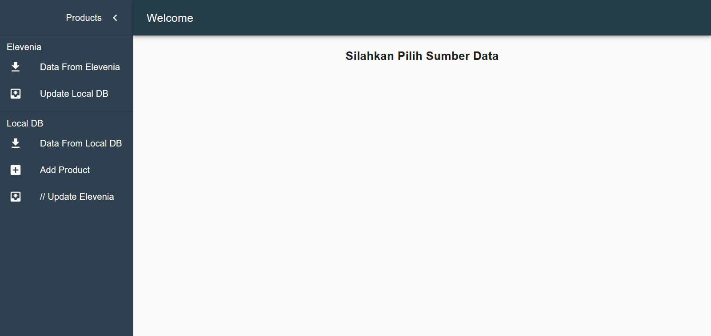
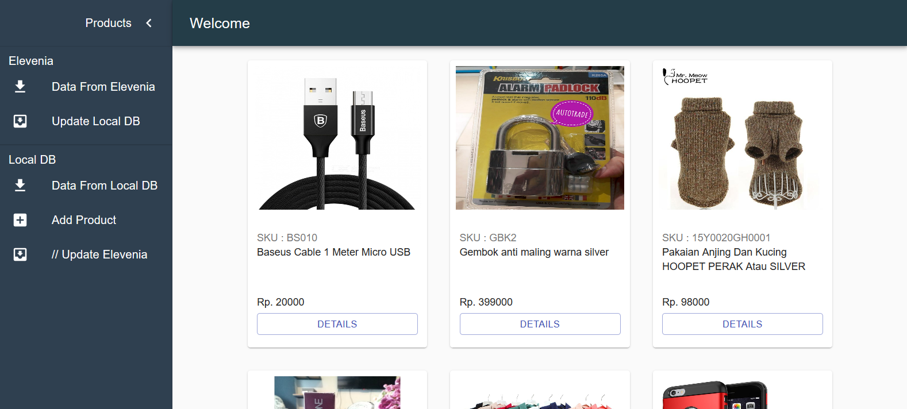

# Test-Jubelio

Test mini project dari Jubelio.com

## Table of Contents

- [Getting Started](#getting-started)
  - [Prerequisites](#prerequisites)
  - [Installation](#installation)
  - [Setup](#Setup)
  - [Run the ReactJs Client](#ReactJs_client)
- [Screenshots](#screenshots)
- [Author](#author)

## Getting Started

Before starting to install the project, there're some things that need to be done first.

### Prerequisites

Make sure all of these are properly installed in your system.

| Application | Download                                                                               |
| ----------- | -------------------------------------------------------------------------------------- |
| Git         | [Windows](https://git-scm.com/downloads) / [Linux](https://git-scm.com/download/linux) |
| Node.js     | [Link](https://nodejs.org/en/download/)                                                |
| React.js    | [Link](https://reactjs.org)                                                            |

### Installation

First, clone this repository into your system.

```
git clone https://github.com/RiskySaptra/Test-Jubelio
```

Then, install all the packages that described in `package.json` of both `client` For ReactJs Front-end and `server` directories for the Back-end .

```
npm install
```

### Setup

For the server setup, first, make sure your Postgres services is running fine. In `server` directory, you'll find `config.json` inside `config` folder. Open and edit the `development` configuration to match your database setup.

```
  "development": {
    "username": "postgres",
    "password": 'YOUR-PASSWORD',
    "database": "YOUR_DATABASE",
    "host": "127.0.0.1",
    "dialect": "postgres"
  },
```

Creating the database using command
`npx sequelize db:create`

Migrating all the model
`npx sequelize-cli db:migrate`

### ReactJs_client

```
npm start
```

### Run the server

```
npm start
```

## Screenshots

- **ReactJs**
  
  
  

## Author

**Muhammad Rizky Saputra** - [RiskySaptra](https://github.com/RiskySaptra)

```

```
